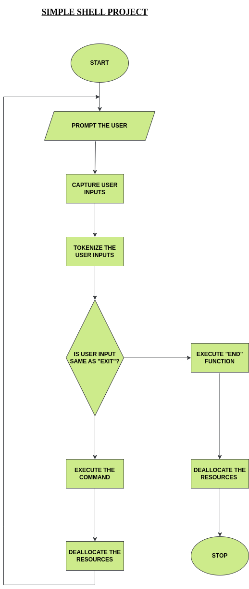

## UNIX Command Interpreter

In this repo, a simple unix command interpreter is implemented using c89 and kernel system calls.

#### Prompting the user

The interpreter displays the prompt ifa command is not piped to it. The prompt is displayed after a command is executed unless is an "exit" command.
This feature is implimented using while() loop, write(), and isatty() system calls.

#### Reading user inputs

The interpreter waits for the user to enter a command. The user as to press "Enter" key to enable it take the next step.
This feature is implimented using getline(), write() and feof(). The file capture-input.c handles this.

#### Parsing the command 

The simple shell tokenizes the user command captured. The file tokens.c has the fucntion tokens() that handles this.

#### Checkin the command

It has to check if the command entered is exit, other inbuilt commands or an executable file. If it is an executable, another process is created using fork() to execute it while the parent waits. 

### Flowchart

